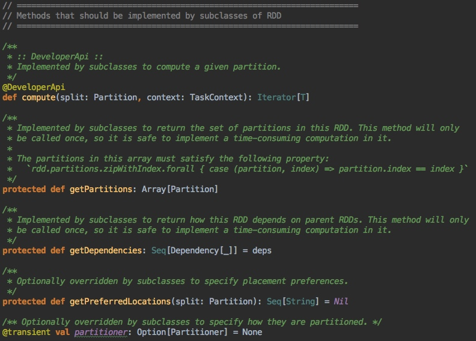

深入理解RDD
-------
> Spark revolves around the concept of a resilient distributed dataset (RDD), which is an **immutable**, **fault-tolerant**, **partitioned** collection of elements that can be operated on in parallel. 

第二篇笔记介绍RDD，整个Spark项目的精髓所在，也是理解Spark源码的金钥匙。RDD是一个很棒的分布式计算抽象模型，它提供了通用的数据处理方法和有效的分布式容错机制，Spark只是它的一种实现。

## Spark基础知识
开始正题之前，先简单介绍一些Spark的基本概念，以便深入介绍RDD。Spark的api运算函数分为两大类，**Transformation**和**Action**：Transformations是**lazy evaluation**的，调用他们只会被记录而不会被真正执行，只有遇到Actions，之前的Transformations才会被依次执行，这样的推迟执行，Spark内部可以做很多优化。Spark的基本工作流程是，用户提交程序给cluster，用户的main函数会在**Driver**上面运行，根据用户的程序Spark会产生很多的**Jobs**，原则是遇到一个**Action**就产生一个**Job**，以DAG图的方式记录RDD之间的依赖关系，每一个Job又会根据要依赖关系被DAGScheduler分成不同的**Stages**，每一个Stage是一个**TaskSet**，以TaskSet为单位，TaskScheduler通过Cluster Manager一批一批地调度到不同node上运行，同一个TaskSet里面的Task都做同样的运算，一个Partition对应一个Task。这个工作流程其实就是Spark的Scheduling Process，附上超经典的示意图，不要纠结这图上的细节，后面会有专门的笔记详细介绍这张***藏宝图***：

## RDD的设计原理
### RDD的设计动机
当时设计RDD主要是为了解决三个问题：

* **Fast**: Spark之前的Hadoop用的是MapReduce的编程模型，没有很好的利用分布式内存系统，中间结果都需要保存到disk，运行效率很低。RDD的**cache**机制，可以把中间结果保存在内存中，重复使用。
* **General: MapReduce**编程模型只能提供有限的运算种类（Map和Reduce），RDD希望支持更广泛的operators（map，flatMap，filter等等），然后用户可以任意地组合他们。
> The ability of RDDs to accommodate computing needs that were previously met only by introducing new frameworks is, we believe, the most credible evidence of the power of the RDD abstraction.

* **Fault tolerance**: 其他的in-memory storage on clusters，基本单元是可变的，用细粒度更新（**fine-grained updates**）方式改变状态，如改变一张table里面的一个值，这种接口设计的容错只能通过复制多个数据copy，需要传输大量的数据，容错效率低下。RDD是不可变的，通过粗粒度变换（**coarse-grained transformations**），比如map，filter和join，把相同的运算同时作用在许多数据单元上，从而产生新的RDD而不改变旧的RDD。这种方式可以很高效地容错，因为Spark会记录用于产生某个RDD的所有transformations（称为Lineage），如果这个RDD的某个partition丢失了，它拥有足够的信息来单独重新计算这个partition。

### RDD的设计原理
#### RDD的定义和属性
在开头的引用中，Spark官网给RDD的定义是：an **immutable**, **fault-tolerant**, **partitioned** collection of elements that can be operated on **in parallel**。其中包括了它的几个特点：

* immutable：任何操作都不会改变RDD本身，只会创造新的RDD。
* fault-tolerant：通过Lineage可以有效容错
* partitioned：RDD以partition作为最小存储和计算单元，分布在cluster的不同nodes上，一个node可以有多个partitions，一个partition只能在一个node上
* in parallel：一个Task对应一个partition，partition之间相互独立，Task可以并行计算

为了实现上面的这些特性，设计的RDD抽象类包含五个主要的属性：

* A list of partitions
* A function for computing each partition
* A list of dependencies on other RDDs
* Optionally, a Partitioner for key-value RDDs (e.g. to say that the RDD is hash-partitioned)
* Optionally, a list of preferred locations to compute each split on (e.g. block locations for an HDFS file)

每一个RDD子类都必须实现这些属性（在源码里面是函数）：

需要研究的几个点
* Dependencies
* Cache

